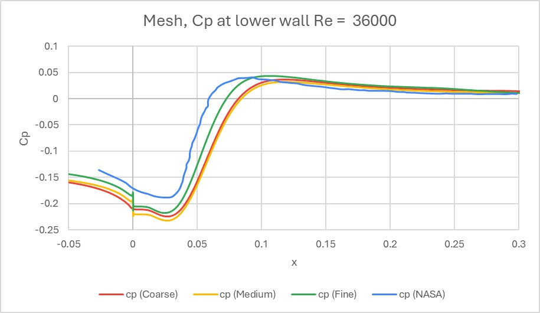

# Turbulent Flow over a Backward-Facing Step

**Verification and Validation of Separated Turbulent Flow using OpenFOAM**

A steady RANS CFD study of the 2D backward-facing step (BFS) — a canonical benchmark for separated flows. This project validates an OpenFOAM workflow against Driver & Seegmiller (1985) experimental data and NASA TMR benchmarks, then performs parametric studies covering Reynolds number sensitivity, turbulence model comparison, geometric scaling, and mesh resolution.

> **Authors:** Dhruv Pratap Singh (B22ME017) & Ripunj Gupta (B22ME054)  
> **Institution:** Department of Mechanical Engineering, IIT Jodhpur  
> **Course:** MEL7400 — Applying CFD Procedures · November 2025

---

## Results at a Glance

| Metric | Value |
|---|---|
| Solver | `simpleFoam` (OpenFOAM 2212, steady incompressible) |
| Turbulence model | k-ω SST (Menter 1994) |
| Baseline Re<sub>H</sub> | 36,000 |
| Predicted X<sub>r</sub>/H | 6.01 |
| Experimental X<sub>r</sub>/H | ≈ 6.0 (Driver & Seegmiller) |
| Validation error | **< 0.2%** |

---

## Visualizations

**Velocity field and streamlines** — large clockwise recirculation bubble downstream of the step:


**Pressure coefficient C<sub>p</sub> vs Driver & Seegmiller experiments** — computed profile matches across all measurement stations:



---

## Methodology

### Geometry and boundary conditions

Based on the Driver & Seegmiller wind tunnel configuration:

- Step height H = 0.0127 m; upstream channel height 0.0762 m; downstream 0.0857 m (expansion ratio 1.125)
- Domain: inlet extension 4H, outlet extension 30H, 2D slice (empty/spanwise)
- **Inlet:** U<sub>ref</sub> = 44.2 m/s, turbulence intensity I = 0.06%, computed k and ω
- **Outlet:** zero-gradient; p = 0 (gauge)
- **Walls:** no-slip with standard wall functions for k and ω

### Solver and numerical schemes

Steady RANS incompressible with eddy-viscosity closure. Convergence criterion: residuals < 10⁻⁶.

| Setting | Value |
|---|---|
| Convection | `linearUpwind` (second-order) |
| Diffusion | `Gauss linear` |
| Gradients | `Gauss linear` (least-squares) |
| Under-relaxation (pressure / momentum) | 0.3 / 0.7 |

### Mesh

Structured hexahedral mesh generated with `blockMesh`. Exponential grading near walls and focused refinement at the step corner. Target wall spacing: 30 < y⁺ < 300 (wall-function range), verified with `yPlus`.

Three grid levels were tested for the convergence study:

| Level | Cells |
|---|---|
| Coarse | ~20,000 |
| Medium | ~80,000 |
| Fine | ~180,000 |

> [!NOTE]
> Medium–Fine difference in X<sub>r</sub>/H is < 0.5%. The **medium mesh** was selected for all parametric runs as it is grid-independent and 4× faster than the fine mesh.

---

## Parametric Studies

### 1. Reynolds number sensitivity (Re<sub>H</sub> = 20k – 50k)

Reattachment length increases weakly from X<sub>r</sub>/H = 5.75 at Re = 20k to 6.22 at Re = 50k. Higher inertia in the separated shear layer delays momentum transfer to the wall. The Re-dependence persists even in fully turbulent flow, so direct scaling of X<sub>r</sub>/H between Reynolds numbers introduces 3–5% error over this range.

### 2. Turbulence model comparison (k-ω SST vs standard k-ε)

Standard k-ε **under-predicts X<sub>r</sub>/H by ~9%**. The model lacks a shear stress limiter, causing excessive eddy viscosity in the adverse pressure gradient region, which forces premature reattachment.

> [!IMPORTANT]
> k-ω SST is required for accurate separated-flow prediction. Standard k-ε is **not suitable** for the backward-facing step without specific calibration.

### 3. Geometric scale invariance

Three step heights (H = 0.00635, 0.0127, 0.01905 m) were simulated at constant Re = 36,000 by adjusting inlet velocity. All non-dimensional C<sub>p</sub>(x/H) profiles collapse onto a single curve, confirming the flow is governed by Re and geometry ratios — not physical size. Design studies can use any convenient scale as long as Re is matched.

### 4. Mesh strategy recommendation

| Mesh | Cells | X<sub>r</sub>/H error vs fine | Speed |
|---|---|---|---|
| Coarse | ~20k | ~2% | 10–20× faster |
| Medium | ~80k | < 0.5% | 4× faster |
| Fine | ~180k | — (reference) | baseline |

For rapid engineering design iterations, the **coarse mesh** accurately captures the primary separation metric (< 2% error) at a 10–20× speedup. Refinement effort should focus on **exponential wall grading**, not uniform cell count increases.

---

## Getting Started

### Prerequisites

- [OpenFOAM](https://www.openfoam.com/) (tested with OpenFOAM 2212)
- [ParaView](https://www.paraview.org/) for post-processing

The full OpenFOAM case files and results are available on [Google Drive](https://drive.google.com/drive/folders/17qGB5OTtWliUDMuo1WTA3ZsKjkKSYPDU?usp=sharing).

### Running the baseline case

```bash
# 1. Extract the case files
unzip backwardFacingStep2D.zip
cd backwardFacingStep2D

# 2. Generate the mesh
blockMesh

# 3. Check y+ distribution
yPlus

# 4. Run the solver
simpleFoam

# 5. Open in ParaView
paraFoam
```

> [!TIP]
> Monitor convergence by plotting residuals: `foamLog log.simpleFoam && gnuplot residuals`. Residuals should drop below 10⁻⁶ for a converged solution.

---

## Repository Structure

```
├── backwardFacingStep2D.zip   # OpenFOAM case files (0/, constant/, system/)
├── project report.pdf         # Full project report with figures and analysis
├── Vortex_U_streamlines.png   # Velocity field visualization
├── ab.jpeg                    # Cp validation plot vs experiments
└── README.md
```

The zip archive contains the standard OpenFOAM directory layout:

```
backwardFacingStep2D/
├── 0/          # Initial/boundary conditions (U, p, k, omega, nut)
├── constant/   # Physical properties and polyMesh
└── system/     # controlDict, fvSchemes, fvSolution, blockMeshDict
```

---

## References

1. D.M. Driver and H.L. Seegmiller, "Features of a reattaching turbulent shear layer in divergent channel flow," *AIAA Journal*, vol. 23, no. 2, pp. 163–171, 1985.
2. NASA Langley Research Center, "Turbulence Modeling Resource – 2D Backward Facing Step," https://turbmodels.larc.nasa.gov/backstep_val.html, accessed November 2025.
3. OpenFOAM Foundation, "Verification and Validation: Turbulent Backward Facing Step," *OpenFOAM Documentation*, 2024.
4. F.R. Menter, "Two-equation eddy-viscosity turbulence models for engineering applications," *AIAA Journal*, vol. 32, no. 8, pp. 1598–1605, 1994.
5. B.F. Armaly et al., "Experimental and theoretical investigation of backward-facing step flow," *J. Fluid Mech.*, vol. 127, pp. 473–496, 1983.
